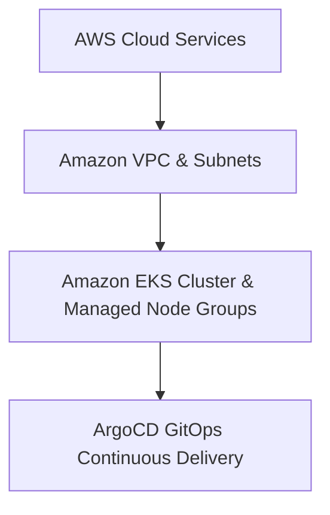

# AWS Enterprise EKS & GitOps Infrastructure

A modular Terraform configuration that provisions an Amazon EKS cluster and sets up continuous delivery with ArgoCD following the Reliability and Scalability Pillars of the AWS Well-Architected Framework.

The primary objective of this deployment is to establish an elastic container platform managed via Infrastructure as Code (IaC), leveraging GitOps methodologies for zero-touch workload synchronization and automated continuous deployment.

Infrastructure fully provisioned as code (IaC) with Terraform.


---

## Infrastructure Architecture Layers

The system organizes orchestration and delivery components into two integrated logical blocks:



**Infrastructure Provisioning (Terraform):** Deploys a customized Virtual Private Cloud (VPC) featuring public and private subnets across multiple availability zones, managed NAT gateways, and an Amazon EKS cluster with managed compute node groups.

**GitOps Continuous Delivery (ArgoCD):** Bootstrapped directly into the cluster control plane to continuously monitor and reconcile target manifests from a Git repository, ensuring absolute state synchronization.

---

## Repository Structure

The code layout separates core infrastructure modules from manifest targets:

```text
├── terraform/                # Infrastructure as Code orchestration folder
│   ├── modules/
│   │   ├── vpc/              # Multi-AZ custom networking and gateways
│   │   └── eks/              # Amazon EKS cluster and managed node groups
│   ├── main.tf               # Root file mapping cluster and networking data flows
│   ├── providers.tf          # AWS provider limits and backend constraints
│   ├── variables.tf          # Environmental baseline input parameters
│   └── outputs.tf            # Active cluster endpoint and connection strings
├── kubernetes/               # GitOps manifests and synchronization targets
│   ├── argocd/               # ArgoCD core installation manifests
│   └── apps/                 # Application deployments managed declaratively
└── README.md                 # System engineering documentation
```

---

## How to Deploy

### Prerequisites
*Valid AWS CLI credentials configured within your active workspace terminal.
*Terraform CLI executable binary installed locally (>= 1.5.0).
*kubectl and Helm command-line utilities configured locally.

### Deployment Steps
**Change directory into the IaC configuration folder:**
```powershell
cd terraform
```
**Initialize the working environment and download provider dependencies:**
```powershell
.\terraform.exe init
```
**Execute standard syntax checks to verify layout validity:**
```powershell
.\terraform.exe validate
```
**Preview the planned structural modifications to the account infrastructure:**
```powershell
.\terraform.exe plan
```
**Deploy the EKS cluster and networking components to AWS:**
```powershell
.\terraform.exe apply -auto-approve
```
**Configure your local kubectl context to connect to the cluster:**
```powershell
aws eks update-kubeconfig --region <aws-region> --name <cluster-name>
```
**Bootstrap ArgoCD for GitOps deployment:**
```powershell
kubectl create namespace argocd
kubectl apply -n argocd -f [https://raw.githubusercontent.com/argoproj/argo-cd/stable/manifests/install.yaml](https://raw.githubusercontent.com/argoproj/argo-cd/stable/manifests/install.yaml)
```
## Clean Up

To tear down all active cluster architectures, node groups, and associated cloud resources to prevent recurring maintenance fees, run the destruction routine:

```powershell
cd terraform
.\terraform.exe destroy -auto-approve
```

---

## Architectural Design Decisions

* **Declarative GitOps Paradigm:** By utilizing ArgoCD as a continuous delivery controller, cluster configuration drift is eliminated. The Git repository serves as the single source of truth for all application workloads.
* **FinOps Resource Overhead Management:** Compute node groups are configured with auto-scaling policies to scale down during low-traffic windows, and control plane management utilizes on-demand serverless or managed structures to balance performance with cost efficiency.