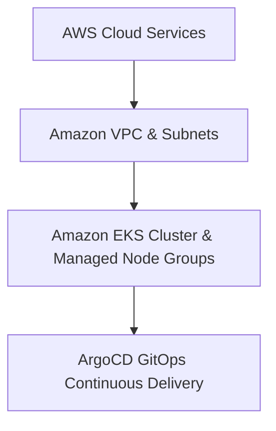

# AWS Enterprise EKS & GitOps Infrastructure

A modular Terraform configuration that provisions an Amazon EKS cluster and sets up continuous delivery with ArgoCD following the Reliability and Scalability Pillars of the AWS Well-Architected Framework.

The primary objective of this deployment is to establish an elastic container platform managed via Infrastructure as Code (IaC), leveraging GitOps methodologies for zero-touch workload synchronization and automated continuous deployment.

Infrastructure fully provisioned as code (IaC) with Terraform.


---

## Infrastructure Architecture Layers

The system organizes orchestration and delivery components into two integrated logical blocks:



**Infrastructure Provisioning (Terraform):** Deploys a customized Virtual Private Cloud (VPC) featuring public and private subnets across multiple availability zones, managed NAT gateways, and an Amazon EKS cluster with managed compute node groups.

**GitOps Continuous Delivery (ArgoCD):** Bootstrapped directly into the cluster control plane to continuously monitor and reconcile target manifests from a Git repository, ensuring absolute state synchronization.

---

## Repository Structure

The code layout separates core infrastructure modules from manifest targets:

```text
├── terraform/                # Infrastructure as Code orchestration folder
│   ├── modules/
│   │   ├── vpc/              # Multi-AZ custom networking and gateways
│   │   └── eks/              # Amazon EKS cluster and managed node groups
│   ├── main.tf               # Root file mapping cluster and networking data flows
│   ├── providers.tf          # AWS provider limits and backend constraints
│   ├── variables.tf          # Environmental baseline input parameters
│   └── outputs.tf            # Active cluster endpoint and connection strings
├── kubernetes/               # GitOps manifests and synchronization targets
│   ├── argocd/               # ArgoCD core installation manifests
│   └── apps/                 # Application deployments managed declaratively
└── README.md                 # System engineering documentation
```

---

